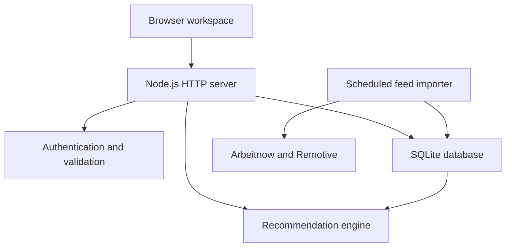

# CareerMatch

A complete self-hosted opportunity discovery and application tracking application. Browse real source-linked jobs without an account; create a private profile to get explainable recommendations, save opportunities, and manage your application journey.

## Features

- Registration, sign-in, logout, password changes and one-time recovery codes.
- Persistent SQLite users, sessions, profiles, bookmarks, applications and catalog.
- Public feeds: Arbeitnow and Remotive, fetched server-side no more than every six hours.
- Public search by keyword, location, type, format and source, with pagination.
- Content-based recommendations using corpus-aware TF-IDF cosine similarity plus skills, interests and preferences. Academic criteria are enforced only when stated; missing requirements say **check source**.
- Saved shortlist and a tracker with Planned, Applied, Interview, Offer, Rejected and Withdrawn stages, private notes and account-data export.
- Administrator dashboard with source health, explicit sync, and create/edit/archive controls for source-linked hackathons, fellowships, internships and jobs.
- Responsive interface, keyboard-operable controls, safe plain-text source descriptions, and empty/error/loading states.
- HTTP-only sessions, CSRF validation, asynchronous scrypt password hashing, rate limiting, prepared SQL, role checks, input validation and security headers.
- Docker packaging, health endpoint, database backup command and automated integration tests.

There are **no fictional production listings** and no required paid APIs. `data/opportunities.json` is an empty retired catalog retained for compatibility with the original repository layout. Production always reads SQLite. Test fixtures are explicitly synthetic and are never imported into the application.

## Start locally

Install **Node.js 24.x** (the app uses `node:sqlite`; this API is still experimental in Node 24). No npm dependencies need installing.

```bash
git clone https://github.com/sooryaprakashrnp-wq/-CareerMatch.git
cd -CareerMatch
cp .env.example .env
npm start
```

On Windows, copy `.env.example` to `.env` using File Explorer or `Copy-Item .env.example .env` in PowerShell. Open **http://localhost:3000**. The first feed import runs in the background; allow up to 45 seconds, then refresh. Feed failure is displayed honestly and does not inject sample listings.

For development, `npm run dev` watches source changes. Persistent data is in `storage/careermatch.db`, which is ignored by Git.

## Administrator setup

1. Set `ADMIN_EMAILS=your-address@example.com` in `.env`. Multiple addresses can be comma separated.
2. Run `npm run create-admin` in a terminal. Enter the same address, a name, and a password when prompted; password input is hidden.
3. Save the recovery code privately and restart the app after changing `.env`.
4. Sign in, open **Manage catalog**, and add opportunities using a verified HTTPS source URL.

Reserved administrator emails cannot be claimed through public registration. The provisioning command never overwrites an existing account. Do not set an arbitrary existing user as an administrator without verifying ownership.

## Account recovery and privacy

Registration and recovery display a high-entropy recovery code once. Keep it private. A reset invalidates old sessions and rotates the recovery code. Email is an account identifier; email ownership is **not verified**. There is no email service, password-reset email, OAuth or automatic job-application submission. Never claim otherwise when presenting the project.

Profiles and application notes are private to the signed-in account. They are not sent to feed providers. Users can export their account data. The deployment owner handles deletion requests. Administrators do not receive a UI for reading other users' private profiles or notes.

## Data sources and rules

- [Arbeitnow Job Board API](https://www.arbeitnow.com/blog/job-board-api): free, keyless, primarily European opportunities. One published API page is fetched per sync; this is not an exhaustive global catalog.
- [Remotive public API](https://github.com/remotive-com/remote-jobs-api): jobs retain Remotive attribution and original links, are available without signing up, and are delayed by 24 hours. CareerMatch respects the recommended maximum of four requests per day through a persistent six-hour cooldown, including failures. Do not syndicate the feed onward to other job boards.
- Curated opportunities are entered by an administrator with a source URL. There is no automated hackathon feed; real hackathons must be sourced and reviewed before adding them.

Remote does **not** imply worldwide eligibility. Country requirements stay visible. The app does not infer visa eligibility. Imported skills are inferred from listing text and can include contextual or preferred mentions. Listings not seen for 14 days are deactivated after a successful source sync; curated deadlines expire after their calendar date. A source can close a listing between refreshes: verify at the original URL before applying.

Failed imports preserve the previous catalog and store a visible error. There is no uncontrolled scraping, arbitrary-URL fetching, or invented live data.

## Recommendations

Each request builds TF-IDF vectors over the current catalog and compares the user's skills, interests and goal text with descriptions. The score combines:

| Signal | Weight |
|---|---:|
| TF-IDF cosine text relevance | 35% |
| Exact normalized skill overlap | 30% |
| Domain interests | 15% |
| Opportunity type | 8% |
| Work format | 7% |
| Location text match | 5% |

Known academic mismatches sort below other opportunities. Unknown requirements are explicitly labeled. This is a deterministic **content-based recommender**, not an LLM, embedding model, collaborative filtering system or hiring-probability model. Scores cannot establish employer eligibility.

Run `npm run evaluate` for a three-query synthetic regression check. Its numbers do not represent real-user performance. Before claiming resume metrics, collect consented relevance judgments, use a held-out evaluation set, and compare against a keyword baseline.

## Operations and deployment

```bash
npm test                 # Unit and end-to-end API tests
npm run evaluate         # Small, explicitly labeled ranking regression
npm run sync             # Import sources (respects persistent cooldown)
npm run backup           # Consistent SQLite backup into backups/
```

Build and run with a persistent Docker volume behind an HTTPS reverse proxy:

```bash
docker build -t careermatch .
docker run -d --name careermatch -p 127.0.0.1:3000:3000 \
  -v careermatch-data:/app/storage \
  -e APP_ORIGIN=https://your-actual-domain.example \
  -e ADMIN_EMAILS=your-address@example.com careermatch
```

Replace the example domain with the actual HTTPS origin. Production rejects an HTTP `APP_ORIGIN`, uses Secure cookies, and requires the browser Origin to match. Provision the administrator with `docker exec -it careermatch node manage.js admin`. Terminate TLS at your hosting platform or reverse proxy. Persist **all of `/app/storage`**, not only the `.db` file (SQLite uses WAL companion files).

For a Node host: start with `npm start`, pin Node 24, set `NODE_ENV=production`, `APP_ORIGIN`, `ADMIN_EMAILS`, and `DATABASE_PATH` on a persistent volume. Health check: `GET /api/health`. This is a **single-instance deployment**: do not run multiple replicas against the same SQLite file. A serverless ephemeral filesystem is unsuitable. Use managed PostgreSQL and shared rate limits before horizontal scaling.

Back up the database regularly and restrict backup access. To restore, stop the app, preserve the current database for recovery, replace it with the backup and remove obsolete WAL/SHM files before restarting. Never replace a live database. Port changes require a matching local `APP_ORIGIN`.

## API map

| Endpoint | Access | Purpose |
|---|---|---|
| `GET /api/health` | Public | Health |
| `GET /api/opportunities` | Public | Filtered, paginated opportunities |
| `POST /api/auth/register`, `/login`, `/recover` | Public, rate limited | Account access |
| `GET /api/auth/me` | Public | Current user and CSRF token |
| `POST /api/auth/logout`, `/password` | Session | Session and password management |
| `PUT /api/profile` | Session + CSRF | Update preferences |
| `GET /api/dashboard`, `/api/export` | Session | Private progress/export |
| `PUT/DELETE /api/saved/:id` | Session + CSRF | Shortlist |
| `PUT/DELETE /api/applications/:id` | Session + CSRF | Tracker |
| `GET /api/admin/status` | Admin | Source status and catalog |
| `POST /api/admin/sync` | Admin + CSRF | Import sources |
| `POST /api/admin/opportunities` | Admin + CSRF | Add curated opportunity |
| `PUT /api/admin/opportunities/:id` | Admin + CSRF | Edit/archive curated opportunity |

Mutation requests use `Content-Type: application/json`. Signed-in mutations also send `X-CSRF-Token` from `/api/auth/me`. Session cookies should never be copied into frontend storage.

## Validation and limits

Tests cover signup/login/recovery, session invalidation, admin-address reservation, CSRF and cross-origin rejection, profile validation, cross-user privacy, bookmarks, tracker updates, catalog administration, provider cooldown/failure, database restart persistence, expiry and ranking. Run tests before committing.

This repository contains the complete self-hosted application and operations setup; it is not automatically deployed by committing it. Public hosting, a persistent disk, TLS and administrator provisioning are deployment-owner responsibilities. It has not undergone an independent security audit or a high-traffic load test. Real feed coverage is global/Europe-weighted, not a guarantee of India-specific internships.

## Project purpose

Students and job seekers often keep opportunity links in several places and lose track of applications. CareerMatch brings discovery, profile-based relevance, shortlisting and application progress into one workspace. It helps users decide what to investigate; the employer's original listing remains the authority on requirements and application submission.

### Intended users

| Role | Main workflow |
|---|---|
| Visitor | Browse and filter source-linked opportunities without creating an account |
| Registered user | Maintain a profile, inspect match explanations, save jobs and track applications |
| Administrator | Monitor imports and maintain curated source-linked opportunities |

## Technology stack

| Layer | Implementation |
|---|---|
| Interface | HTML, CSS and vanilla JavaScript; responsive single-page workspace |
| Server | Node.js 24, built-in HTTP server and JSON API |
| Persistence | SQLite through `node:sqlite`, WAL mode and foreign keys |
| Authentication | Scrypt password hashes, server-side sessions and recovery codes |
| Recommendation engine | TF-IDF cosine similarity and weighted profile signals |
| External data | Arbeitnow and Remotive public APIs |
| Tests | Built-in Node.js test runner and HTTP integration tests |
| Packaging | Docker with persistent storage |
| Automation | GitHub Actions runs tests and ranking regression checks |

There are no third-party npm runtime dependencies. The application does not require an LLM API key, paid data subscription, or a separately installed database server.

## Architecture



1. The browser loads static interface files and requests JSON from the same origin.
2. The server validates requests and checks the session, CSRF token and administrator permission where required.
3. The importer fetches supported providers, normalizes listings and stores catalog records and source health.
4. Discovery reads active, unexpired catalog entries. Signed-in profile information supplies recommendation signals.
5. Bookmarks and application records are stored against the current user's ID. The interface renders the saved state after successful API operations.

## Repository guide

| Path | Responsibility |
|---|---|
| `server.js` | HTTP routing, API handlers, access checks, static files and sync scheduling |
| `database.js` | Schema creation, SQLite connection, catalog reading and opportunity upserts |
| `auth.js` | Password verification, session tokens, recovery helpers and cookies |
| `validation.js` | Input normalization and profile/listing validation |
| `matcher.js` | Content vectors, weighted scoring and eligibility explanations |
| `feeds.js` | Provider adapters, normalization, cooldown and failure handling |
| `manage.js` | Administrator provisioning, feed sync and database backups |
| `evaluate.js` | Small synthetic recommendation regression evaluation |
| `public/index.html` | Application shell and navigation |
| `public/styles.css` | Responsive visual styling |
| `public/app.js` | Discovery, authentication, profile, saved, tracker and admin interactions |
| `test/matcher.test.js` | Persistence and deadline regression checks |
| `test/platform.test.js` | Ranking, providers and complete API workflow tests |
| `data/opportunities.json` | Empty retired sample catalog; not the production data source |
| `.env.example` | Configuration template without credentials |
| `Dockerfile` | Container build, runtime user and health check |
| `.github/workflows/ci.yml` | Automated checks on pushes and pull requests |

## Configuration reference

Copy `.env.example` to `.env` before changing local configuration. Restart the server after changes.

| Variable | Local example/default | Purpose |
|---|---|---|
| `PORT` | `3000` | HTTP listening port |
| `APP_ORIGIN` | `http://localhost:3000` | Exact browser origin, including scheme and port; HTTPS in production |
| `NODE_ENV` | `development` | Set `production` for production cookie and origin requirements |
| `DATABASE_PATH` | `./storage/careermatch.db` | Database file on writable, persistent storage |
| `ADMIN_EMAILS` | Empty | Comma-separated reserved administrator account addresses |
| `SYNC_ENABLED` | `true` | Set `false` to disable automatic feed synchronization |

Never commit `.env`, database files, backups, session cookies or recovery codes. The repository includes ignore rules for local secrets and persistent data.

## User walkthrough

### Discover an opportunity

1. Start the server and open `http://localhost:3000`.
2. Browse the public catalog. Search and filter by keyword, location, opportunity type, work format or source.
3. Open a listing to inspect its description, source, restrictions and original application link.
4. Register or sign in to use profile-based matching and private tools.

### Build a profile and shortlist

1. Open **Profile** and enter your academic information, skills, interests and preferences.
2. Save the profile and return to discovery to review personalized relevance and skill gaps.
3. Read the original listing before deciding whether you qualify. An unknown requirement is not a confirmed match.
4. Save useful opportunities and review them in **Saved**.

### Track applications

1. Add an opportunity to the application tracker.
2. Set its stage to Planned, Applied, Interview, Offer, Rejected or Withdrawn.
3. Maintain private notes and update the stage as your application progresses.
4. Export account data when needed.

Opening an employer link does not submit an application or automatically mark it Applied. The user applies on the original site and updates the tracker themselves.

### Maintain the catalog

1. Provision an administrator using the command documented above.
2. Sign in and open **Manage catalog**.
3. Inspect provider health and the last import result. Manual synchronization still respects provider cooldowns.
4. Add reviewed opportunities with a real HTTPS source URL and available requirements.
5. Edit or archive curated records as their details change.

## Database model

| Table | Stored information | Relationship |
|---|---|---|
| `users` | Account identifier, name, password hash, recovery hash and profile JSON | One user has sessions, saved items and applications |
| `sessions` | Hashed token, user ID, CSRF token and expiry | References `users` |
| `opportunities` | Provider identity, unique source URL, listing payload, active flag and last-seen time | Referenced by saved items and applications |
| `saved` | User ID, opportunity ID and creation time | Unique pair prevents duplicate bookmarks |
| `applications` | User ID, opportunity ID, status, notes and update time | One tracker record per user/opportunity pair |
| `feed_runs` | Last attempt, last success, item count and error per source | Durable source monitoring and cooldown state |

SQLite initializes the schema on startup. JSON payloads store flexible profile and opportunity fields; relational keys connect accounts and activity. A database restart does not clear application data. Backups contain private account data and must be protected accordingly.

## Security design

- Passwords use salted asynchronous scrypt hashing rather than plaintext storage.
- Session tokens are random and stored as hashes on the server; cookies use HttpOnly and SameSite controls, with Secure enabled in production.
- Signed-in mutations require a CSRF token, and origin checks reject unsupported cross-origin requests.
- Prepared statements, field validation, role checks and user-scoped queries protect database operations.
- Recovery rotates the recovery code and invalidates existing sessions.
- Source descriptions are rendered as plain text; security headers restrict browser behavior.
- Authentication endpoints have rate limiting. Scaling to multiple instances requires shared rate-limit infrastructure and a different persistence design.

These controls are implementation features, not a security certification. Email ownership verification and an independent security assessment remain outside this version's scope.

## Verification and project presentation

Run these commands from the repository root:

```bash
npm test
npm run evaluate
```

The test suite covers five test groups, including a complete API lifecycle for accounts, private profiles, saved opportunities, application updates, recovery and administration. Other checks cover ranking, provider normalization, failed imports, cooldown persistence, database restart persistence and deadline expiry. GitHub Actions repeats the automated checks on pushes and pull requests.

`npm run evaluate` uses three hand-authored queries. It is a repeatable regression check, not evidence of real-world recommendation accuracy. Test fixtures are separate from live catalog data. Listing counts vary by provider and import time, so do not present a historical import count as a permanent catalog size.

Suggested demonstration sequence:

1. Browse actual source-linked opportunities as a visitor.
2. Sign in, save a profile and explain the score components on a listing.
3. Save an opportunity and update its application stage and notes.
4. Restart the server to demonstrate persistence.
5. Show administrator source health and curated listing controls.
6. Run tests and explain the architecture and current limits.

## Troubleshooting

| Symptom | What to check |
|---|---|
| `node:sqlite` cannot be loaded | Confirm `node --version` is Node.js 24.x |
| Empty catalog on first launch | Allow the initial import to finish; check source health and outbound network access |
| A manual import is skipped | The persistent six-hour provider cooldown may still apply |
| Feed request fails | Review source status; previous catalog data remains available after failed imports |
| Sign-in or changes fail after moving to a new domain | Match `APP_ORIGIN` to the actual browser origin and restart the server |
| Production cookies are unavailable | Use HTTPS and the configured origin; production cookies are Secure |
| Port is already in use | Choose another `PORT`, update `APP_ORIGIN` to match and restart |
| Data disappears after redeployment | Mount a persistent volume at `DATABASE_PATH`; ephemeral storage is unsuitable |
| Administrator registration is rejected | Reserved addresses must be provisioned with `npm run create-admin` |
| Expected listing is missing | Check filters, active status, deadline, provider coverage and source availability |
| Remote job has a country restriction | Remote format does not remove the employer's geographic requirements |

## Current scope and future work

The implemented version provides a self-hosted discovery, recommendation and application-management workflow. Publishing source to GitHub does not create a running public website.

The following are **future enhancements, not implemented features**:

- Verified email, email-based recovery and optional OAuth sign-in.
- Resume document parsing and user-reviewed skill extraction.
- Semantic embeddings with a held-out relevance evaluation dataset.
- Additional licensed sources and stronger India-specific coverage.
- User-controlled account deletion and notification preferences.
- Managed PostgreSQL, migrations, shared rate limits and multi-instance operation.
- Browser automation tests, accessibility auditing and load testing.

## Maintainer and licensing

Maintained in [sooryaprakashrnp-wq/-CareerMatch](https://github.com/sooryaprakashrnp-wq/-CareerMatch). Report reproducible problems through the repository's Issues page with steps, expected behavior and actual behavior. Do not attach credentials or private account exports.

No project license file is currently included. Public visibility alone does not grant an open-source license. External job data remains subject to its provider's terms and attribution requirements.
